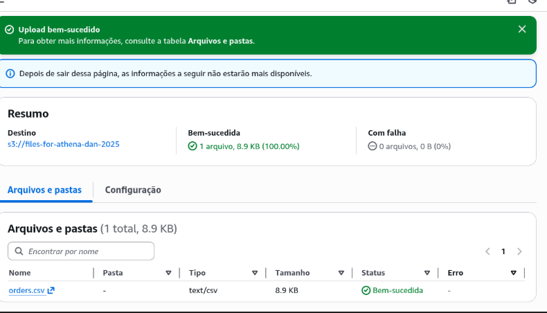
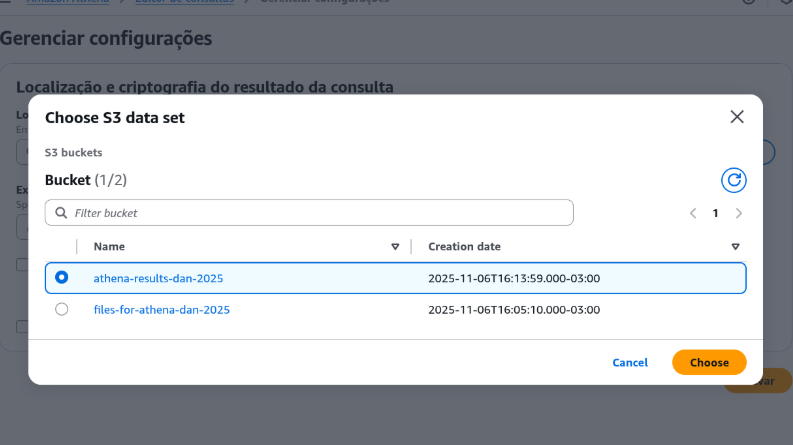
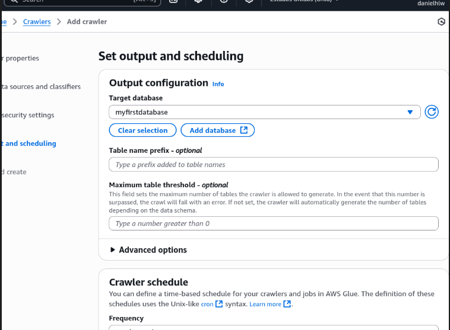

- Criar um bucket: [console S3](https://us-east-2.console.aws.amazon.com/s3/bucket/create?region=us-east-2)
	- Adicionar região, bucket name e ok.
	- Depois disso, pode deixar tudo padrão e criar o bucket, que deve ter nome exclusivo.
	- 

- Upload de um arquivo para o bucket:
	- Com um exemplo de um csv, bastaria arrastar o arquivo até o bucket e clicar em "carregar".
	- 

- Acessar o athena no console: [Athena](https://us-east-2.console.aws.amazon.com/athena/home?region=us-east-2#/landing-page)
	- Escolha um local para exibir a consulta, caso for a primeira vez acessando.
	- Voltando para o S3, é necessário fazer o backup de todos os buckets e criar um novo.
	- Agora podemos voltar para o athena e filtrar pelo bucket que foi criado.
	- Depois disso, navegue até o Athena, vá para a parte de editar e navegue para o S3. Após isso, escolha o bucket que você acabou de criar.
	- 

- Detalhe importante: O Athena não vai armazenar os dados reais lá, ele não é um banco de dados relacional. São metadados, ou seja, dados a partir do bucket no S3.

- Agora vamos usar um rastreador glue (Glue Crawler) para rastrear e mapear os dados, que é bem fácil.
	- 
	- Adicione o nome do rastreador
	- Aponte para os dados no S3 (add a data source)
	- Adicione as informações do bucket e avance
		- 
	- Agora precisamos dar permissão pro IAM role (configurações de segurança para o IAM role dar para o Glue):
		- Crie um nome com o prefixo que está definido.
		- 
	- Agora vamos lidar com a saída. O rastreador vai "farejar" os dados no S3 e criará uma tabela para eles.
	- Ele precisa saber onde colocar ela, ou seja, precisa ser um banco de dados (coleção de tabelas), ficando:
		- 
		- Quando o rastreador terminar, ele criará a tabela dentro desse banco de dados e ela conterá os *metadados*
	- Após isso, basta confirmar todos os dados, criar o rastredor e executar.
			